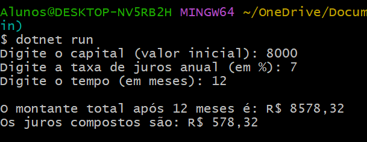

# ParaMeuCurriculo

### Juros Compostos
 #### O que foi utilizado
- **Tecnologias**: .NET 6, C#, Visual Studio ou Visual Studio Code.
- **Ferramentas**: Git para controle de versão e GitHub para repositório.

#### Etapas implementadas
1. **Método de Cálculo de Juros Compostos:** Foi implementado um método público CalcularJurosCompostos que recebe como parâmetros o capital inicial, a taxa de juros anual e o tempo de investimento em meses.
2. **Método para Interação com o Usuário:** O método Executar solicita que o usuário insira os valores de capital inicial, taxa de juros anual e tempo de investimento.
Ele então chama o método de cálculo e exibe o montante total e os juros compostos calculados com duas casas decimais.
3. **Execução do Programa:** No método Main, foi criada uma instância da classe Program, que executa o processo de entrada de dados, cálculo e saída de resultados.

### Conclusão
O projeto foi bem-sucedido ao fornecer uma implementação simples e funcional para calcular juros compostos. O programa realiza as operações matemáticas necessárias e interage de forma clara com o usuário, apresentando os resultados formatados. Isso ajuda os usuários a entender o impacto da taxa de juros e do tempo sobre o montante final em uma aplicação financeira.
